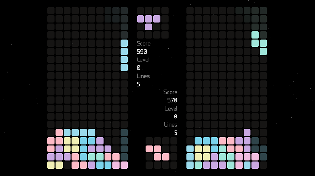

## TERE

**TERE** is short for **Tetris Revisited** and was a term project for my Software Development 2 class at The University of Agder during the fall semester of 2017. 

Our goal was to create a Tetris clone that would be close to the Nintendo GameBoy and NES versions from the late 1980s. We wanted to include a computer opponent so it would be possible to have competition even when playing alone, and making it as challenging as possible. We discussed whether we should have local- or network-based multiplayer, and initially decided that we would aim for networkbased. The inclusion of power-ups, as well as various visual effects were other initial goals that were discussed.

Setup instructions will come at a later point.

**The entire report describing this project is around 50 pages, only parts of it is included here to give you a better understanding of the project. If you have any questions, feel free to contact me**

### Functional  Requirements
- Build a Tetris-clone using C++/SFML
    
    The application should be graphical, follow most of the NES Tetris rules and be playable using the keyboard or with a controller.
- Sound and music

    The application should have sound and music, and it should be possible for the user to enable or disable them from the menu, as well as adjust the volume.

- Inclusion of an AI opponent

    The application should have an AI opponent the user can play against, the

- Menu system for navigation

    A menu system should be implemented to navigate between the various states in the application. Preferably using any form of input (keyboard, joystick or mouse)

- User-selectable resolution 

    The application should adapt to the resolution selected for the window by the user, and present the game in the same way regardless of resolution.

- Multiple Game Modes

    The application should have a range of different game modes to try, the two game modes from the NES Tetris version should be included, as well as others to be determined later.

- High Scores 

    The user should be able to save their high scores, so they can improve on them over time.

- Persistent settings

    The settings selected by the player for the various options should be saved, so they remain the same after the application is closed and re-opened.

- Ability to reconfigure controls

    The user should be able to reconfigure the keyboard controls to their own preference. There should be a separate menu state for this purpose.

### Non-functional Requirements
- Cost

    The project period is limited to ten weeks, the functionality of the application should be contained to a reasonable level to it is possible to complete within the time frame.

- Emotional Factor

    The application should have a pleasant design, the music and sound effects should be chosen carefully, so players will want to return to it after playing for the first time.

- Robustness 
    
    The application should run without errors for a prolonged amount of time, it should be tested for critical bugs that terminates the application as well as for memory leaks.

- Platform compatibility

    The application will be designed for Windows 10, but it should also be tested on older versions of Windows, back to Windows 7, to ensure a certain degree of backwards compatibility.

- Security  

    The save file for the high scores should not be saved in plain text, but instead employ encryption to make it harder for players to cheat. However, since this is a single-player game it is not a critical requirement.

- Testability

    The application should be programmed in such a way that it can easily be modified to test various scenarios with the AI and/or different game modes.

### Game Engine
**Line Completion Animation** The animation for line completion is the same as the NES version. It has five steps and removes two blocks at a time, starting from the center of the playing field. It will advance one step for every 4 frames and in the event of a tetris, it will also flash white during the first frame of each step. With all of this in place, we had a game that closely resembled the NES Tetris version. Some nuances may have been left out, but the feel of playing it is verysimilar. The next step was implementing the various game modes, except for
Marathon mode, which is the default mode and was already operational.

**Line Clear** To implement Line Clear mode, we had a counter for the number of lines left to clear and when the player reaches this goal the game is won. In multiplayer, the player who gets to 0 lines first, will win the round, ending the game for both players. We had to make a system to generate garbage lines if the player(s) choose to play with a height set to non-zero.

**Battle Mode** In Battle Mode, we made a system to insert incomplete lines at the bottom of the opponent’s playing field when a player completes two or more lines. This is done after the line completion animation finishes for both the player and for the opponent, in case the opponent completes a line at the same time.

**Sprint Mode** In Sprint Mode the goal is to complete 40 lines as fast as possible. Since SFML does not have a way to pause a timer, we had to “park” the current time if the game was paused, reset the timer when the game became unpaused, and make sure to add the two together when displaying the time on screen and for highscore purposes. We had to write a method that translates the milliseconds stored in the timer to a more comprehensible format in the form of minutes, seconds and centiseconds that is displayed on-screen.

One Lone Coder’s implementation, nor the NES Tetris version had a ghost piece, that is, a preview of where the current piece will land given its current translation and rotation. We added one to our game, since it is common in most modern Tetris games to include it.

*This project was also reviewed in one of "One Lone Coder"'s YouTube videos, click [here](https://youtu.be/ZxMx2NUT5sw?t=1m23s)*

### Cedits
I also need to give credits to my project partners Jan Øvind Kruse and Erik Tokheim.